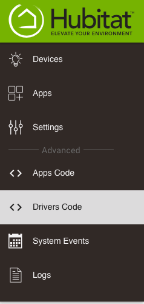
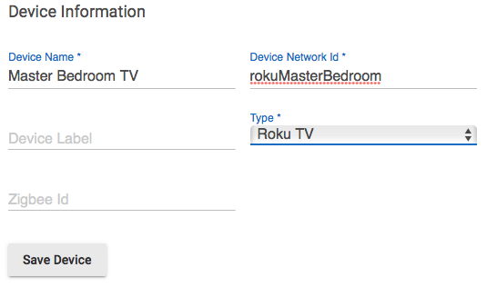
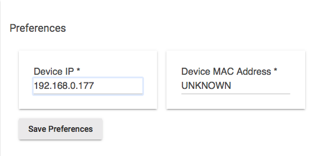
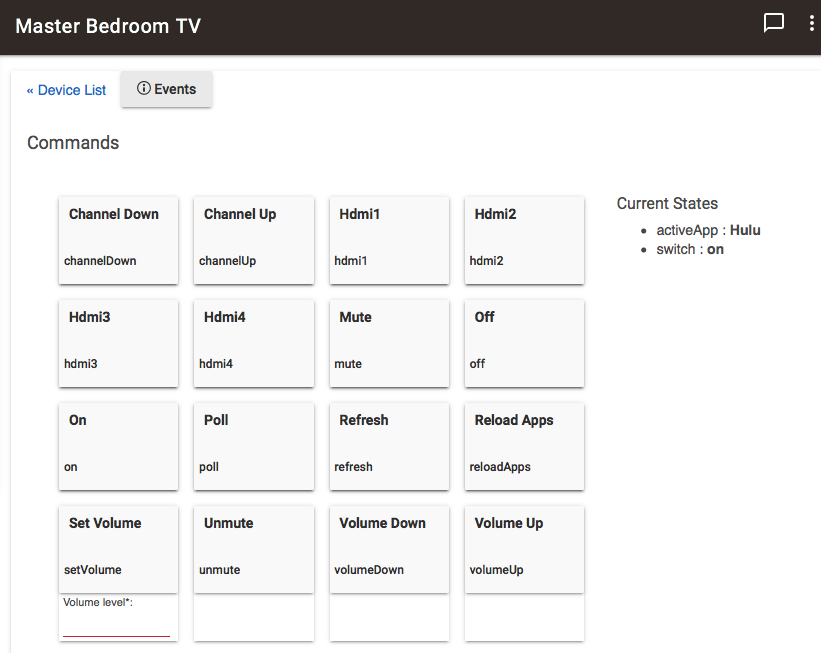

# Hubitat Drivers

Presently, this project is host to one solution, my implementation of the **Roku TV + App Control** Device handlers for Hubitat.

## Getting Started

To use this software, you must download two files:
 - [roku-tv.groovy](devices/roku-tv.groovy)
 - [roku-app-child.groovy](devices/roku-app-child.groovy)

## Installation
Sign into your Hubitat device, and add the two device handlers.  To do so, from the menu select the **"Drivers Code"** menu option.

Next, click the **"(+) New Driver"** button

Select the import button, and put in the URL to the [roku-app-child.groovy](devices/roku-app-child.groovy), Click the import button, and the new driver is ready.  
Click **Save**. 

Next, navigate to **"Drivers Code"**
and repeat the process for the [roku-tv.groovy](/devices/roku-tv.groovy) driver.

## Configuration

The configuration is quite simple, and tries to be as automatic as possible.  Once the two device handers are installed, you will need to add the new Roku TV devices that you want to automate, and configure the IP Address.

### Prerequisite
For smart home automation to work reliably, all devices on your network that will be access from the Hubitat hub should be configured with a static address.  This also true for the Roku TV devices.  I cannot provide details on how to do this, as each network is unique, and different routers have a different solution.  If your devices receive their network address via the router using DHCP (Dynamica Host Configuration Protocol) -- this is most typical -- then you may need to configure your router to *reserve* the IP address assigned to the Roku device.  This way, every time the Roku device is powered on, it will always have the same IP address, and the Hubitat, and this device handler will know how to find it.

### Adding the Roku Device
To add your Roku device, navigate the **Devices** in the Hubitat menu, and select **Add Virtual Device**

Give your device a Friendly, but unique device name, and device network Id.
I like to prefix my Device Network Id with a discriptive prefix to help ensure uniqueness, and to isolate my virtual devices by type. Be sure to select the new **Roky TV** devicea as the type, and then Save the device information.

Enter the IP Address of your Roku TV device in the Prefrences section, the MAC address is not required, it will attempt to fill-in when the Roku device is queried.

Click the **Save Prefrences** button.  

### Finalizing the configuration

The next step is a little quirky, because the Roku TV device handler is going to auto-configure this device as much as possible.  If you do not see the device **Current States**, then I recommend issuing a browser refresh. This can be achieved by pressing the `F5` key on Windows, and some Linux systems, or `CMD+R` on MacOS.

## Using the new device

Once the device looks something like the above image, your TV is configured and ready to go.

At this point, you should see the installed child devices for the apps, which should look something like this:

Note:  The MAC address is used to institute a wake-on-lan event to wakeup Roku devices that entered into a deep sleep.

### How to use

All the button on the Roku TV device implement the Hubitat standards for control of the associated commands.  The Roku API does not appear to provide a direct mechanism to set some of the parameters available.  

**Features** 

| Command | Description |
| - | - |
| Volumne Up | Increments the volume by 1 step |
| Volume Down | Decrements the volume by 1 step |
| Set Volume | _not supported by Roku API_ at this time |
| Channel Up | Change channel up |
| Channel Down | Change channel down |
| Mute | Toggle the audio Mute state on/off |
| Unmute | _not support by Roku API_ same behavior as Mute |
| On | Turn the TV on |
| Off | Turn the TV off |
| Poll | Issues a Refresh |
| Refresh | Forced refresh of TV state |
| Reload Apps | Deletes and reloads all child devices |

_At present, the `Set Volume` button is ignored_.  
The Roku API does not report mute state, so mute and unmute is just a toggle, both calling the mute button event.

Although Hubitat has what it needs to see this as a TV type device, the current Alexa skill app does not support the TV type, so it will appear as a standard switch.

Note: The TV Device does not keep an active link with the Roku, and there is not facility within the Roku API for this.  As such, this handler will only issue a poll/refresh once every five (5) minutes.  And the current application is polled once every minute, as this is a much smaller request.

### Roku App (Child Device)

The Roku App child device handler is just a child switch.  The switch allows the buttons to appear in Alexa as devices.  The status of the switch will automatically change to on or off based on the currently running application.  If the switch is commanded on or off, then the switch status will change to turning-on or turning-off until the actual state is confirmed.

## License

This project is licensed under the MIT License - see the [LICENSE.md](LICENSE.md) file for details.  Portions of this code are licensed from Eric Boehs [LICENSE.md](https://raw.githubusercontent.com/ericboehs/smartthings-roku-tv/master/LICENSE)

## Acknowledgments
This software would not be possible without the efforts and free sharing of information provided by the original authoris of the [TCL Smartthings Roky TV](https://github.com/ericboehs/smartthings-roku-tv) created by [Eric Boehs](https://github.com/ericboehs).

Additional thanks go to Roku for freely publishing the [External Control API](https://sdkdocs.roku.com/display/sdkdoc/External+Control+API) documentation.
